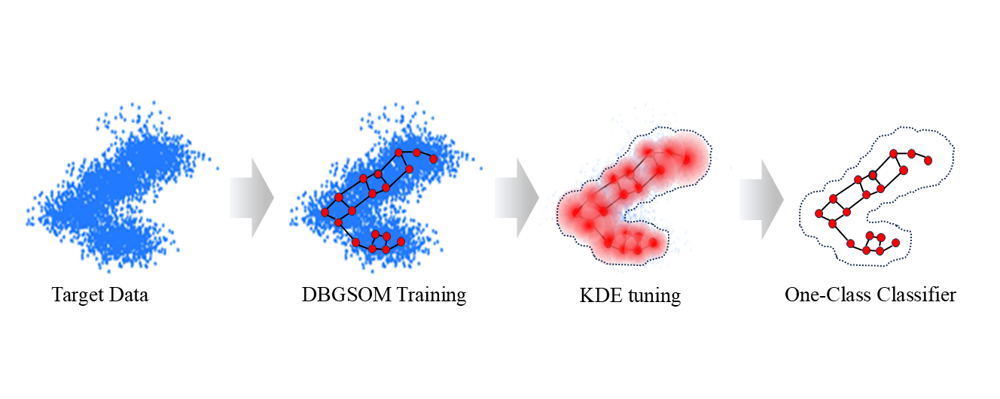

# DOC-SOM
Code for the paper "DOC-SOM" by Mahdi Vasighi and Hamid Khoeini. Developed jointly, and currently maintained by Hamid Khoeini.

## Authors
**Mahdi Vasighi**, **Hamid Khoeini**  
_(as listed in the original paper)_

## About this repository
This repository contains the implementation for the paper **"DOC-SOM"**, co-authored by Mahdi Vasighi and Hamid Khoeini.

The codebase was collaboratively developed.  
Some components were written by **Mahdi Vasighi**, and others by **Hamid Khoeini**.

This version is maintained by **Hamid Khoeini**, co-author and contributor to the codebase.

## How to Run

To execute the code, follow these steps:

1. Run the main script:

- Sub python main.py

2. After launching, you will be prompted to:

- Sub Select the dataset by entering its corresponding number.

- Sub Select the target class within the chosen dataset.

3. You can manually configure several key parameters in the source code, such as:

- Sub DBGSOM network growth rate

- Sub Amount of impurity added to the selected class

- Sub Other training and evaluation settings

# These parameters can be adjusted directly within the code files before running the program.

